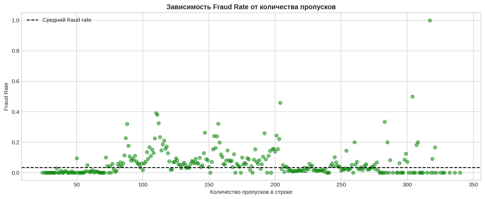
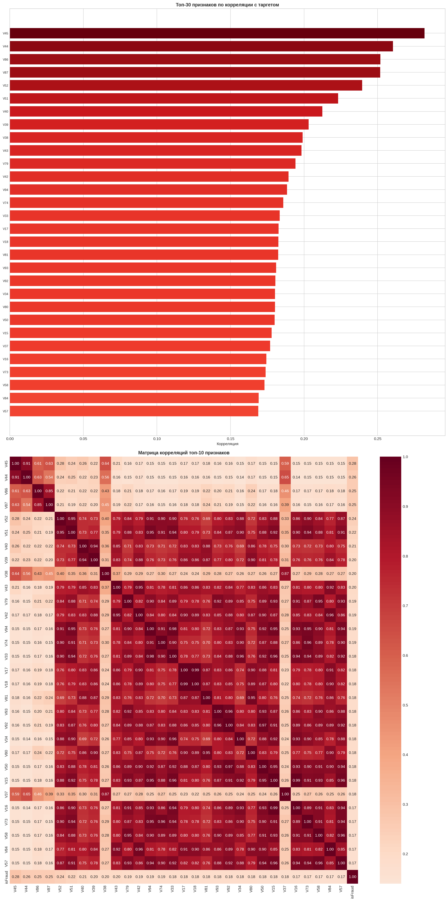

# IEEE-CIS Fraud Detection: Решение Kaggle-соревнования

Автор: Леднева Дарья.

[](https://www.kaggle.com/competitions/ieee-fraud-detection)

## Описание проекта

Данный проект представляет собой решение задачи детектирования мошеннических транзакций в рамках соревнования [IEEE-CIS Fraud Detection](https://www.kaggle.com/competitions/ieee-fraud-detection) на платформе Kaggle.

**Цели проекта:**
- Подготовить базовое решение (baseline) с использованием LightAutoML (LAMA)
- Реализовать альтернативное решение без использования LAMA
- Превзойти результаты baseline собственным решением
- Провести полный EDA с обоснованием гипотез

**Таблица результатов:**
| Модель | Validation ROC-AUC |
|--------|-------------------|
| LAMA Config 1 (базовые признаки, 3-fold CV) | 0.90384 |
| LAMA Config 2 (с FE, 5-fold CV) | 0.90242 |
| CatBoost (базовый) | 0.89446 |
| CatBoost + Optuna | 0.93057 |

Как видно, LAMA бейзлайн побить **удалось**.

---

## Описание соревнования

### Задача

**Задача классификации:** по набору признаков транзакции определить вероятность того, что транзакция является мошеннической.

### Метрика

Решения оцениваются по метрике **ROC-AUC** - площадь под кривой ошибок.

### Призовой фонд 

Соревнование имеет денежные призы и подходит под критерий:

- 1 место: $10,000
- 2 место: $7,000  
- 3 место: $3,000

---

## Структура репозитория

```
ieee-fraud-detection/
├── data/                           # Директория с данными (не включена в репозиторий)
│   ├── train_transaction.csv
│   ├── train_identity.csv
│   ├── test_transaction.csv
│   ├── test_identity.csv
│   └── sample_submission.csv
├── reports/                        # Визуализации и отчёты EDA
├── submissions/                    # Файлы submission для Kaggle
├── EDA.ipynb                       # Exploratory Data Analysis
├── LAMA.ipynb                      # LightAutoML baseline решение
├── MLSolution.ipynb                # Собственное решение (CatBoost)
├── feature_transformers.py         # Кастомные sklearn трансформеры
├── utils.py                        # Вспомогательные функции
├── requirements.txt                # Зависимости проекта
└── README.md                       # Документация проекта
```

---

## Данные

### Источник данных

Данные предоставлены компанией Vesta Corporation и содержат реальные e-commerce транзакции.

### Структура данных

Данные разделены на две таблицы:

**1. Transaction Table**

| Группа признаков |
|-----------------|
| `TransactionID` | 
| `TransactionDT` |
| `TransactionAmt` | 
| `ProductCD` |
| `card1-card6` | 
| `addr1, addr2` | 
| `dist1, dist2` |
| `P_emaildomain` |
| `R_emaildomain` | 
| `C1-C14` | 
| `D1-D15` |
| `M1-M9` |
| `V1-V339` |
| `isFraud` | 

**2. Identity Table**

| Группа признаков |
|-----------------|
| `TransactionID` | 
| `id_01-id_38` | 
| `DeviceType` |
| `DeviceInfo` |

### Объединённый датасет

После merge по `TransactionID`:
- **Train:** 590,540 строк × 434 признака
- **Test:** 506,691 строк × 433 признака

---

## Exploratory Data Analysis (EDA)

### Анализ целевой переменной

#### Распределение классов

```
Распределение классов:
├── Не мошенничество (0): 569,877 (96.50%)
└── Мошенничество (1):     20,663 (3.50%)

Дисбаланс классов: 1:28
```

**Выводы:**
- Сильный дисбаланс классов (3.5% положительного класса)
- Необходимо использовать stratified split для корректной валидации

#### Временной анализ целевой переменной

Анализ fraud rate во временном разрезе выявил следующие паттерны:

| Временной срез | Наблюдения |
|---------------|------------|
| **По дням** | Fraud rate стабилен (~3.5%) с небольшими колебаниями |
| **По часам** | В ночные часы (0-6) fraud rate **выше** при меньшем количестве транзакций |
| **По дням недели** | Выходные дни показывают незначительно отличающийся fraud rate |

**Гипотеза:** Временные признаки (час, день недели, флаг выходного/ночного времени) могут быть информативны для модели.

---

### Типизация и анализ признаков

#### Автоматическая типизация

Реализована функция `get_feature_types()` для автоматического определения типов признаков.

**Результаты типизации:**

| Тип | Количество |
|-----|------------|
| Числовые | 395 |
| Категориальные | 33 |
| Бинарные | 7 |

#### Анализ ключевых групп признаков

**V-признаки (V1-V339):**
- Инженерные признаки от Vesta Corporation
- Многие признаки сильно коррелируют между собой
- Топ признаков по корреляции с target преимущественно V-признаки

**D-признаки (D1-D15):**
- Timedelta-признаки (дни с какого-то события)
- D1 предположительно - дни с первой транзакции по карте
- Требуют нормализации относительно TransactionDT

**C-признаки (C1-C14):**
- Счётчики связанных сущностей
- Интерпретация: количество карт, адресов, email и т.д.

**Card-признаки (card1-card6):**
- Хешированная информация о карте
- card1 + addr1 могут идентифицировать пользователя

---

### Анализ пропущенных значений

#### Общая статистика

```
Колонок с пропусками: 414
Колонок без пропусков: 23

Топ-20 колонок по количеству пропусков:
   column  missing_count  missing_pct
0   id_24         585793       99.196
1   id_25         585408       99.131
2   id_08         585385       99.127
3   id_07         585385       99.127
4   id_21         585381       99.126
5   id_26         585377       99.126
6   id_23         585371       99.125
7   id_22         585371       99.125
8   id_27         585371       99.125
9   dist2         552913       93.628
10     D7         551623       93.410
11  id_18         545427       92.361
12    D13         528588       89.509
13    D14         528353       89.469
14    D12         525823       89.041
15  id_04         524216       88.769
16  id_03         524216       88.769
17     D6         517353       87.607
18  id_33         517251       87.589
19  id_09         515614       87.312
```

#### Связь пропусков с целевой переменной

**Гипотеза:** Количество пропусков в записи коррелирует с вероятностью мошенничества.

**Результаты:**
- Создание признака `n_missing` потенциально информативно
- Особенно важны пропуски в identity-признаках (`n_missing_identity`), там их больше всего
- Как видно по графику, некоторые всплески есть, явной зависимости не наблюдается, но некоторая корреляция может иметь место быть



---

### Выявление аномалий

#### Методология

Для выявления выбросов использован метод **IQR (Interquartile Range)**:

```python
def detect_outliers_iqr(series: pd.Series):
    q1 = series.quantile(0.25)
    q3 = series.quantile(0.75)
    iqr = q3 - q1
    lower = q1 - 1.5 * iqr
    upper = q3 + 1.5 * iqr
    return (series < lower) | (series > upper)
```

#### Ключевые выводы

Проанализировано признаков: 205 (брались только те признаки, у которых менее 50% пропусков). Признаков с значимыми выбросами: 188. Для каждого вычислено:
- Процент выбросов
- Fraud rate в выбросах vs норма
- Разница fraud rate

Видно, что это преимущественно V-признаки.

**Гипотеза:** Выбросы в определенных признаках являются индикатором мошенничества.


---

### Корреляционный анализ

#### Корреляция с целевой переменной

**Выводы:** 
- V-признаки сильнее всего коррелируют с таргетом и между собой
- Для линейных моделей требуется удаление мультиколлинеарных признаков. Для gradient boosting это менее критично, можно оставить, а в решении будет именно бустинг.



---

## Гипотезы Feature Engineering

На основе EDA сформулированы следующие гипотезы для feature engineering:

### Временные паттерны мошенничества

**Гипотеза:** Fraud rate зависит от времени суток и дня недели.

**Обоснование:** EDA показал повышенный fraud rate в ночные часы.

### User ID из комбинации признаков

**Гипотеза:** Комбинация `card1 + addr1` идентифицирует пользователя.

**Обоснование:** Мошенники часто используют одни карты/адреса многократно. Агрегация по UID позволит выявить аномальное поведение.

### Нормализация D-признаков

**Гипотеза:** D1 = количество дней с первой транзакции по карте.

**Обоснование:** `TransactionDT/86400 - D1` даёт дату первого использования карты.

### Частотное кодирование категориальных признаков

**Гипотеза:** Редкие или наоборот повторяющиеся значения категориальных признаков чаще связаны с мошенничеством.

**Обоснование:** Мошенники могут использовать нетипичные устройства, редкие email-домены.

### Агрегации по группам

**Гипотеза:** Статистики транзакций внутри группы (карта, адрес, email) информативны.

**Обоснование:** Отклонение от среднего по группе - сигнал мошенничества.

### Индикаторы пропусков

**Гипотеза:** Количество пропусков коррелирует с мошенничеством.

**Обоснование:** По мошенникам могут быть левые карты, отстуствие ID и так далее.

---

## Подход к  валидации

### Анализ временной структуры данных

Данные содержат временную компоненту TransactionDT:
- Train: транзакции отсортированы по времени
- Test: следует за train по времени

### Выбор стратегии разделения

**Выбор: Time-based Split 80/20**

**Обоснование:**
1. Предотвращает утечку информации из будущего в прошлое
2. Соответствует реальному сценарию использования модели (предсказываем новые транзакции)
3. Test set соревнования также отсортирован по времени
4. Даёт более честную оценку качества модели

**Результаты разбиения:**

```
Train size:       472,432 (80%)
Validation size:  118,108 (20%)

Train period:     day 0 - day 140
Val period:       day 140 - day 182

Train fraud rate: 3.51%
Val fraud rate:   3.44%
```

---

## Моделирование

### LAMA Baseline

#### Подготовка данных для LAMA

Перед обучением LAMA была проведена минимальная предобработка данных. Основной шаг - удаление колонок с более чем 95% пропущенных значений. В результате было удалено 26 колонок.

#### Конфигурация 1: Базовый LAMA

Первая конфигурация представляет собой baseline без дополнительного feature engineering.

**Параметры:**
- Timeout: 1200 секунд (20 минут)
- CPU limit: 4 ядра
- CV: 3-fold
- Признаки: базовые (без FE)

Выбор 3-fold CV обусловлен желанием получить первичный результат для понимания baseline качества модели.

**Результаты:**
- Validation ROC-AUC: **0.90384**

#### Конфигурация 2: LAMA с Feature Engineering

Вторая конфигурация использует расширенный набор признаков.

**Параметры:**
- Timeout: 1800 секунд (30 минут)
- CPU limit: 4 ядра
- CV: 5-fold
- Признаки: с feature engineering

**Добавленные признаки (11 штук):**

Временные признаки:
- `hour`- час транзакции (0-23)
- `day` - день от начала отсчёта
- `weekday` - день недели (0-6)
- `is_weekend` - флаг выходного дня
- `is_night` - флаг ночного времени (0-6 часов)

Статистики пропусков:
- `n_missing` - общее количество пропусков в строке
- `missing_ratio` - доля пропусков от общего числа признаков
- `n_missing_identity` - количество пропусков в identity-признаках
- `n_missing_V` - количество пропусков в V-признаках

Признаки суммы транзакции:
- `TransactionAmt_log` - логарифм суммы транзакции
- `is_round_amount` - флаг круглой суммы


**Результаты:**
- Validation ROC-AUC: **0.90242**

**Лучшая конфигурация:** Config 1

Добавление feature engineering не улучшило результат, что говорит о том, что LAMA уже в базовой конфигурации дает максимальный результат.

---

### Собственное решение

#### Архитектура

Для собственного решения был реализован sklearn pipeline с кастомными трансформерами, как было указано в критериях задания. 

Pipeline состоит из следующих этапов:

1. **TimeFeatureTransformer** - извлечение временных признаков из TransactionDT
2. **UIDFeatureTransformer** - создание User ID по пользователям
3. **DNormalizationTransformer** - нормализация D-признаков относительно времени транзакции
4. **FrequencyEncoder** - частотное кодирование топ категориальных признаков
5. **AggregationTransformer** - создание агрегированных признаков по группам (card1, addr1, P_emaildomain)
6. **MissingIndicatorTransformer** - создание признаков на основе статистики пропусков
7. **FeatureSelector** - отбор числовых признаков и заполнение оставшихся пропусков

#### Модель 1: CatBoost с базовыми параметрами

В качестве основной модели выбран CatBoost. Базовая конфигурация использовала консервативные параметры: глубина деревьев (4), learning rate (0.02) и количество итераций (10,000) с early stopping.

**Результаты:**
- Validation ROC-AUC: **0.89446**

Много ниже бейзлайна, как видно.

#### Модель 2: CatBoost + Optuna Hyperparameter Tuning

Для улучшения результатов был проведён автоматический подбор гиперпараметров с помощью Optuna. 

**Оптимизируемые параметры:**
- `learning_rate` - скорость обучения (0.01–0.1, логарифмическая шкала)
- `depth` - глубина деревьев (6–12) - была раньше 4-10, заметила, что чем больше глубина, тем лучше
- `l2_leaf_reg` - L2 регуляризация (0.001–10.0)
- `min_child_samples` - минимум сэмплов в листе (20–200)
- `subsample` - доля сэмплов для каждого дерева (0.6–1.0)

Было проведено 50 trials оптимизации. Каждый trial обучал модель на 5,000 итераций с early stopping.

**Лучшие параметры:**
- learning_rate: 0.02435556801888748
- depth: 12
- l2_leaf_reg: 8.30310328108448
- min_child_samples: 27
- subsample: 0.8953622178900084

**Результаты:**
- Validation ROC-AUC: **0.93057**

---

## Результаты

**Таблица результатов:**
| Модель | Validation ROC-AUC |
|--------|-------------------|
| LAMA Config 1 (базовые признаки, 3-fold CV) | 0.90384 |
| LAMA Config 2 (с FE, 5-fold CV) | 0.90242 |
| CatBoost (базовый) | 0.89446 |
| CatBoost + Optuna | 0.93057 |

### Feature Importance

Самый важный признак D1_normalized - нормализованный timedelta, что подтверждает гипотезу о ценности приведения D-признаков к единому масштабу относительно времени транзакции.
На втором месте - счётчик C13, на третьем - сумма транзакции TransactionAmt. Из топ-10 признаков 6 созданы в ходе Feature Engineering: нормализованные D1 и D15, количество транзакций пользователя uid_count, частотное кодирование M4 и M5, а также сумма транзакций по карте. Также, в топе есть агрегации по пользователю - в топ-30 вошли 9 таких признаков: частота использования card1+addr1, средняя сумма и std, агрегации по картам и адресам. Как видно, гипотезы про UID пользователя, нормализацию D, частотное кодирование и агрегации полностью подтвердились - созданные на их основе признаки имеют хороший вес по важности.


---

## Воспроизведение результатов

### Требования

Полный список зависимостей находится в файле `requirements.txt`.

### Данные

Данные необходимо скачать со страницы соревнования на Kaggle и разместить в директории `data/`. Требуемые файлы:
- train_transaction.csv
- train_identity.csv
- test_transaction.csv
- test_identity.csv
- sample_submission.csv

### Запуск

Проект состоит из трёх основных скриптов, которые следует запускать последовательно:

1. **EDA.ipynb** - exploratory data analysis, генерация визуализаций
2. **LAMA.ipynb** - обучение LAMA baseline (обе конфигурации)
3. **MLSolution.ipynb** - собственное решение с CatBoost и Optuna

---

## Выводы

### Что сработало

1. **Time-based split** - корректная стратегия валидации дала реалистичную оценку качества модели

2. **Feature Engineering** - созданные признаки улучшили качество модели:
   - Временные признаки подтвердили гипотезу о различии fraud rate в разное время суток
   - UID-признаки позволили выявить аномальное поведение пользователей
   - Нормализация D-признаков привела их к единому масштабу

3. **CatBoost на GPU**

4. **Optuna** - автоматический подбор гиперпараметров

5. **Большая глубина деревьев** - лучшие параметры при глубине 12, скорее всего, при большей глубине были бы результаты еще выше. Что для меня лично удивительно, в бигтехе обычно связка глубины 4 и lr 0.02 выбивало скор близкий к лучшему при таком же числе фичей и несбалансированной целевой.

### Что не сработало или требует улучшения

1. **Удаление мультиколлинеарных признаков** - для gradient boosting моделей пробовала (за кадром), это не дало улучшения, так как они устойчивы к коррелированным признакам

2. **Категориальные признаки** - пробовала явно в CatBoost прокидывать категориальные фичи, тоже за кадром, не дало улучшения

### Возможные дальнейшие улучшения

1. **Adversarial validation** - проверка различий между train и test для выявления потенциального concept drift

2. **Более продвинутый FE** - создание взаимодействий признаков, применение PCA для групп V-признаков

3. **Ансамбль моделей** - комбинация предиктов нескольких обученных моделей

---

## Late Submission

На приватном лидерборде submission для LAMA и моего решения показали такой результат:


